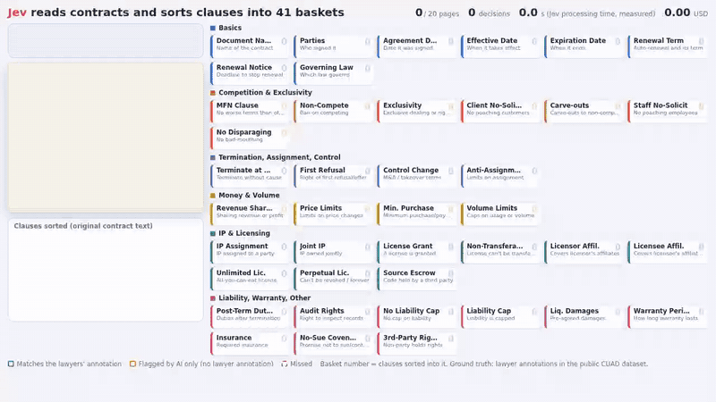

# jev-hanko

A measured comparison of **Jev** (TypeSafe AI's decision-specialised model) against fast, cheap LLMs
on a real legal task: checking a contract page against **41 clause types at once**.

日本語版はこちら → [README.ja.md](README.ja.md)

**The task**: for every page of a contract, decide which of 41 clause types appear on that page,
and drop the page into the matching baskets.



**The same job, raced against fast and cheap LLMs**:


Neither video is staged — both replay the latency and the verdicts that were actually measured.

- Run it in your browser: [sorting](https://matu79go.github.io/jev-hanko/sort.html?lang=en) / [the race](https://matu79go.github.io/jev-hanko/?lang=en)
- Video files: `media/demo_sort_en.mp4`, `media/demo_en.mp4` (Japanese versions drop the `_en`)

## Results (500 English contract pages × 41 clauses = 20,500 decisions; ground truth = lawyer annotations)

| Model | Latency per page (mean) | Cost per 1,000 pages | Recall | Precision | F1 |
|---|---|---|---|---|---|
| **Jev (all 41 in one call)** | **0.40 s** | $0.117 | 68.3% | 41.9% | 0.519 |
| Llama 3.1 8B (fastest provider) | 0.57 s | $0.074 | 55.4% | 10.8% | 0.180 |
| Qwen 3.7 Flash | 0.84 s | **$0.060** | 65.7% | 59.3% | **0.623** |
| gpt-oss-20b (fastest provider) | 0.92 s | $0.175 | 59.5% | 52.2% | 0.556 |
| Gemini 2.5 Flash-Lite (IDs only) | 1.08 s | $0.206 | 73.9% | 21.7% | 0.335 |
| Claude Haiku 4.5 | 1.47 s | $2.143 | 79.1% | 37.4% | 0.508 |
| Gemini 2.5 Flash-Lite (all 41 clauses) | 1.50 s | $0.322 | 72.0% | 51.0% | 0.597 |
| Claude Sonnet 5 (200 pages) | 2.36 s | $6.068 | 77.0% | 52.1% | 0.622 |

- Latency is the wall-clock time from sending the request to receiving the full response, averaged per page.
- In this measurement Jev was the fastest of every configuration tried. It is cheaper than the mainstream
  models, though Qwen 3.7 Flash came in at half its price. Accuracy sits mid-pack.
- This is the result for *this* task, *this* prompt and *this* set of competitors. A different phrasing
  or a different task could change it.
- Raw aggregate output: [`results/cuad_500x41_2026-09-19.txt`](results/cuad_500x41_2026-09-19.txt)

## Try it

### 0. No API key, no cost

```bash
git clone https://github.com/matu79go/jev-hanko && cd jev-hanko
python3 -m pytest -q          # tests; no external API calls
# open docs/sort.html and docs/index.html in a browser to replay the measurement
```

### 1. Call Jev once (about $0.00003)

You need an [OpenRouter](https://openrouter.ai/) API key. Pass it via the environment; never commit it.

```bash
export OPENROUTER_API_KEY=...
python3 scripts/smoke_jev.py
```

Jev is served only from OpenRouter's `/api/alpha/decisions` endpoint — it cannot be called via `/chat/completions`.

### 2. Reproduce the measurement

```bash
# Fetch CUAD v1 (CC BY 4.0)
curl -L -o data.zip https://github.com/TheAtticusProject/cuad/raw/main/data.zip
unzip data.zip CUADv1.json

# Small run (100 pages; roughly $0.05 for Jev + Flash-Lite)
python3 scripts/eval_cuad.py CUADv1.json --pos 50 --rand 50 --llm google/gemini-2.5-flash-lite

# The full run behind the table above (about $3 across all models)
python3 scripts/eval_cuad.py CUADv1.json --pos 250 --rand 250 --calib 100 \
  --llm google/gemini-2.5-flash-lite anthropic/claude-haiku-4.5 qwen/qwen3.7-flash \
        meta-llama/llama-3.1-8b-instruct:nitro openai/gpt-oss-20b:nitro \
  --llm-full google/gemini-2.5-flash-lite \
  --llm-small anthropic/claude-sonnet-5 --small-n 200
```

Responses are cached under `cache/`, so re-running the same conditions costs nothing.
Latency varies with your network and the time of day.

### 3. Rebuild the demo and the videos (optional)

```bash
python3 scripts/export_demo.py CUADv1.json docs/demo_data.js   # write demo data from the cached measurement
pip install playwright && playwright install chromium          # needed for recording (plus ffmpeg)
python3 scripts/record_demo.py sort        # -> media/demo_sort.mp4 / .gif
python3 scripts/record_demo.py race en     # -> media/demo_en.mp4 / .gif
```

Requires Python 3.10+. The evaluation code depends only on the standard library.

## Layout

| Path | Contents |
|---|---|
| `jev_hanko/jev_client.py` | Jev client (OpenRouter Decisions API) |
| `jev_hanko/llm_client.py` | Client for the comparison LLMs |
| `jev_hanko/cuad_task.py` | Builds per-page questions and ground truth from CUAD |
| `scripts/eval_cuad.py` | The measurement (threshold calibration, LLM comparison) |
| `scripts/export_demo.py`, `scripts/record_demo.py` | Demo data export and screen recording |
| `docs/` | Demo pages (GitHub Pages) |

## Data

- [CUAD v1](https://www.atticusprojectai.org/cuad) (The Atticus Project, CC BY 4.0). `docs/demo_data.js`
  contains excerpts from CUAD contracts.

## License

MIT for the code. Data follows the terms of its own source.
